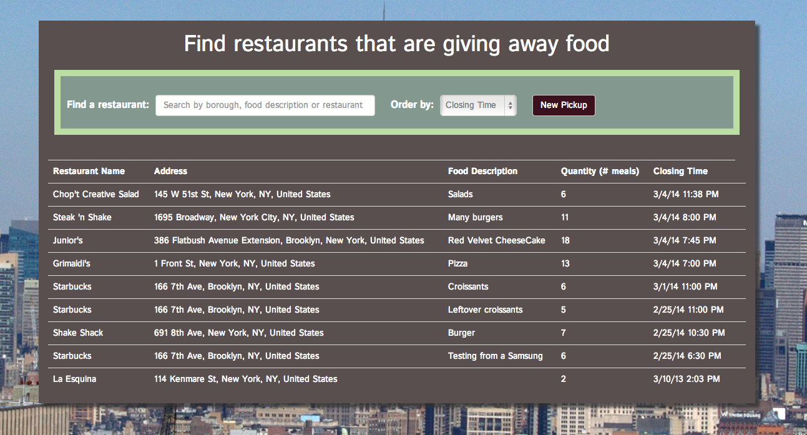

# Rescuisine!



Rescuisine is a web application that allows Restaurants to simply and quickly post the food they are about to throw out so Homeless Shelter Volunteers can come and pick it up.

## Demo

Visit http://rescuisine.herokuapp.com/

## Command Line

Bundle the Gemfile

```ruby
bundle install
```

Migrate your database
```ruby
rake db:migrate
```

Start Redis and Sidekiq in separate terminal window (For background proccessing of Twillio integration)

```ruby
redis start
```

```ruby
bundle exec sidekiq -r ./app.rb
```

Run the server

```ruby
rackup
```

Application will be running on http://localhost:9292/

## How to use Rescuisine?
#### For Restaurants
A restaurant can create a new pickup by clicking the "New Pickup" button


They will be taken to a page where they can locate their restaurant via Google Maps. Once the location is confirmed they will be taken to the actual form to create the Pickup.


#### For Volunteers
A voluteer can schedule to do a pickup by clicking on any of the rows then the "Pickup?" button


They will then be taken to a new confirmation page where they can input their phone number.


After inputing their phone number, the restaurant and the voluteer will both receive text messages with a confirmation code for the pickup.

## Credits

Rescuisine was created and maintained by
Keith Williams Jr. [Blog](http://codewardbound.tumblr.com/),[Github](https://github.com/kphillycat) and Oliver Switzer [Blog](http://allyourcodesarebelongtous.tumblr.com/), [Github](https://github.com/oliverswitzer)

Rescuisine leverages technologies [Sinatra](http://www.sinatrarb.com/), [AngularJS](http://angularjs.org/), [Sidekiq](http://sidekiq.org/), [Faye](http://faye.jcoglan.com/), and [Twillio](https://www.twilio.com/) 
